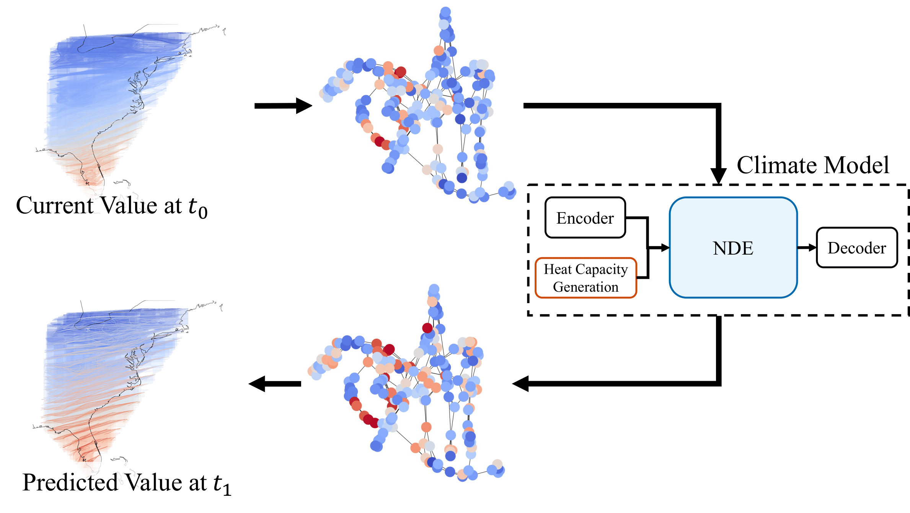
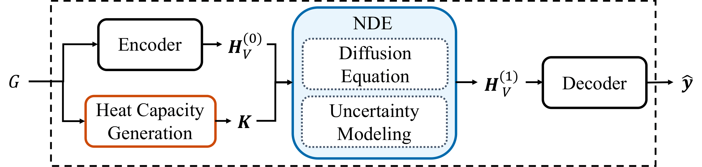

# Climate Modeling with Neural Diffusion Equation
[](https://arxiv.org/abs/2111.06011)  [](https://sites.google.com/view/npark/home?authuser=0)

## Introduction
This is the repository of our accepted ICDM 2021 paper "Climate Modeling with Neural Diffusion Equations". Paper is available on [arxiv](https://arxiv.org/abs/2111.06011)

## Our Proposed NDE



## Setup python environment for NDE

#### Install python environment
```{bash}
conda create -n nde python==3.8.0
conda install pytorch==1.7.0 cudatoolkit=11.0 -c pytorch
pip install torch-scatter -f https://pytorch-geometric.com/whl/torch-1.7.0+cu110.html
pip install torch-sparse -f https://pytorch-geometric.com/whl/torch-1.7.0+cu110.html
pip install torch-cluster -f https://pytorch-geometric.com/whl/torch-1.7.0+cu110.html
pip install torch-spline-conv -f https://pytorch-geometric.com/whl/torch-1.7.0+cu110.html
pip install torch-geometric
pip install pyyaml
pip install tensorboardX
pip install torchdiffeq
```

or you can install conda environment via `environment.yml`
```{bash}
conda env create -f environment.yml
```

#### Activate environment
```{bash}
conda activate nde
```

## How to run

#### One-step prediction for LA Dataset
```{bash}
bash run.sh
```

#### Experimental Setting (See more detail in cfg_files_ode/*.yaml)
- file
    - LA.yaml, SD.yaml
- model_path
    - **False**, True
- comment
    - default: ''
- gpu
    - default: 0
